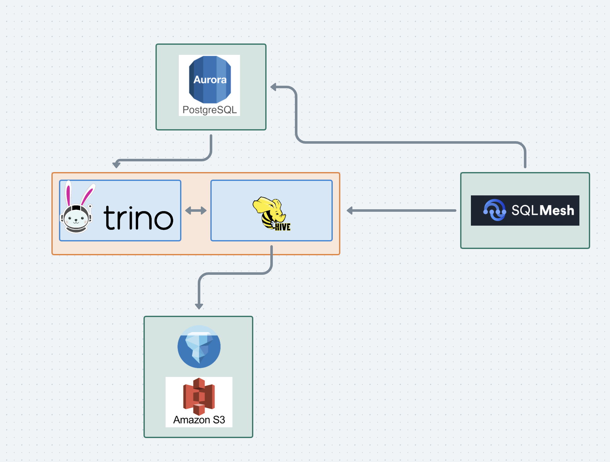

# Disclaimer

This is a minimal trino + sqlmesh deployment for development / POC.  
In production is recommended to deploy this using [Kubernetes with Helm](https://trino.io/docs/current/installation/kubernetes.html)




# Hive Setup for Iceberg, PostgreSQL, and S3

Two s3 buckets need to be setup: `trino-catalog` and `trino-spooling`. The latter is needed to enable disk spill if needed during a query.
A postgres instance is required to keep the hive metastore state persistent. This could be ammended to use other database types.
Make sure the .env file has all of listed variables. `POSTGRES_PASSWORD_XML` (postgres password) will be needed in order to inject the password into the hive-site.xml file safely as it likely contains special characters that need to be escaped.

These files need to be downloaded for Hive to work with Iceberg, PostgreSQL, and S3:

- `curl -O https://repo1.maven.org/maven2/com/amazonaws/aws-java-sdk-bundle/1.11.375/aws-java-sdk-bundle-1.11.375.jar`
- `curl -O https://repo1.maven.org/maven2/software/amazon/awssdk/aws-java-sdk-s3/1.12.749/aws-java-sdk-s3-1.12.749.jar`
- `curl -O https://repo1.maven.org/maven2/org/apache/hadoop/hadoop-aws/3.3.1/hadoop-aws-3.3.1.jar`
- `curl -O https://repo1.maven.org/maven2/org/apache/iceberg/iceberg-hive-runtime/1.4.0/iceberg-hive-runtime-1.4.0.jar`
- `curl -O https://repo1.maven.org/maven2/org/postgresql/postgresql/42.5.4/postgresql-42.5.4.jar`

Place these files in the main directory (where `docker-compose-dev.yml` is located).

The downloaded files may need 644 file permisissions:
```bash
chmod 644 <filename>
```
This ensures that the container can read the files.
Refer to the file `pre-setup.sh` for a complete run through of the setup.
`conf/hive/metastore-site.xml` needs the following changed:
```
<value>jdbc:postgresql://your_postgres_instance_host:5432/metastore</value>
```

When running for the first time, set IS_RESUME: "false" in the docker-compose-dev.yml file.

# Using SQLMesh

Once the trino and hive containers are up and running, we can use SQLMesh to interact with them and create models.  

The easiest way to do this is to use something like pyenv or conda to create a python virtual environment.  

Once inside the virtual environment, use `pip install -r sqlmesh/requirements.txt` to install all of the requirements needed for sqlmesh to work with trino.

The trino host and port are exposed to sqlmesh using the environment variables `TRINO_PORT` and `TRINO_HOST`, so make sure these have been set appropriately. 